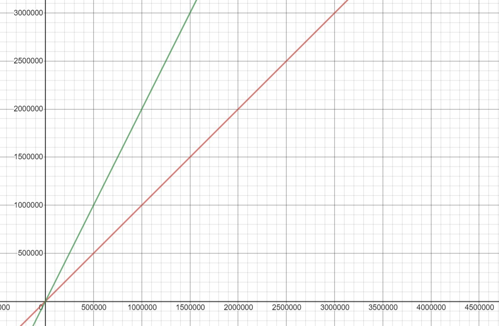

# Big O Notation

Big O Notation (*Big O* for short) simply put, is a way for programmers to measure the efficency of their algorithms. Generally, the lower the Big O value, the better the performance. Assign statements, conditionals, and similar commands have a Big O of O(1) while loops and nested loops have a Big O of O(n) and O(n^2) respectively. 

Rarely, if ever, do we have a single line of code. So how do we determine the Big O notation for multiple commands? Well, we simply add them together!

For example:

```python
def i_am_a_function (self):
    x = 5
    if(x >= 5):
        print("Hello World!")
```

In this sample we have 3 commands. The first command `x=5` is O(1). The next two commands: `if(x >= 5)` and `print("Hello World!)` also have O(1). Adding these together, we get O(3). With Big O notation though, when we have anything higher than O(1) we can simply reduce the number back down to a 1! In our example above, the O(3) notation would reduce down to O(1).

Looking at this graphically...
.jpg)


How about another one:

```python 
def multiple_loops(self):       
    for numbers in range(0,10):
        print(numbers) 
    for numbers in range(10,0,-1):
        print(numbers)
```

In this code block, the Big O would be O(n)+O(n) but like in the previous example, we can reduce it. O(n) + O(n) would reduce to O(2n). Because O(n) and O(2n) have similar performance, we can also drop the 2 and are left with O(n).N signifing that there can be any number of items to print. Imagine if we had chosen to print all the numbers from 0 to **1 billion**. This would take a significant amount of processing power and time to complete. 

 Look at it this way:


As our data sample gets larger and larger the performance follows a similar pattern. 


How about one more?

```python

```