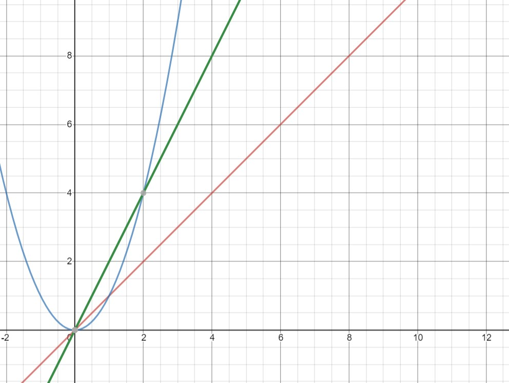

# Big O Notation

Big O Notation (*Big O* for short) simply put, is a way for programmers to measure the efficency of their algorithms. Generally, the lower the Big O value, the better the performance. Assign statements, conditionals, and similar commands have a Big O of O(1) while loops and nested loops have a Big O of O(n) and O(n^2) respectively. 

Rarely, if ever, do we have a single line of code. So how do we determine the Big O notation for multiple commands? Well, we simply add them together!

For example:

```python
def i_am_a_function (self):
    x = 5
    if(x >= 5):
        print("Hello World!")
```

In this sample we have 3 commands. The first command `x=5` is O(1). The next two commands: `if(x >= 5)` and `print("Hello World!)` also have O(1). Adding these together, we get O(3). With Big O notation though, when we have anything higher than O(1) we can simply reduce the number back down to a 1! In our example above, the O(3) notation would reduce down to O(1).

Looking at this graphically we see that 
.jpg)


How about another one:

```python 
def multiple_loops(self):       
    for numbers in range(0,10):
        print(numbers) 
    for numbers in range(10,0,-1):
        print(numbers)
```

In this code block, the Big O would be O(n)+O(n) but like in the previous example, we can reduce it. O(n) + O(n) would reduce to O(2n). When working with Big O noation, we drop coefficients though because the extra amount of work is negligable. N signifies that there can be any number of items to print. Imagine if we had chosen to print all the numbers from 0 to **1 billion**. This would take a significant amount of processing power and time to complete. In the graph below, you can see the comparison in the preformances of O(n) in red and O(2n) in green.

Did I hear 'another please'?

```python
def nested_loops(self, people):
    for names in people:
        for letters in x:
            print(letters)
```
In this case we have a nested loop. Because the 2nd for loop depends on the amount of information being passed to it from the upper for loop it also has a Big O of O(n) so when we combine the two together we get a notation of O(n^2). In comparison to the other two that we talked about, O(n^2) is in blue. 



Gross, right? The performance that we would get when running nested loops is pretty bad, and it only gets worse the larger the data set that we have. Imagine if we had 1 million names in our list of people. That would get really ugly really fast.


We can't even see the blue line anymore...that's pretty bad. It's best to avoid using nested loops like this unless we know that our data set is going to be small.

You might be thinking then that the best performace that we can get is O(1) then, right? Well, there are some functions written by some geniuses somewhere that get better performance than that. Can you believe it?! The best performace that we can get is O(log n). 

That looks like this...
.jpg)

This typically occurs when you cut your data in half for each iteration through your loop. For example, imagine that you are looking through a phone book for my name, Mathew. The computer would look at the letter that is exactly half way though the book and compare it to the first letter of my name. If it were further down the list (greater than the current letter) it wouldn't have to worry about all the other letters that are earlier in the list (less than the current letter). Following this pattern we could quickly cut down our time to find my name. This would result in a O(log n).