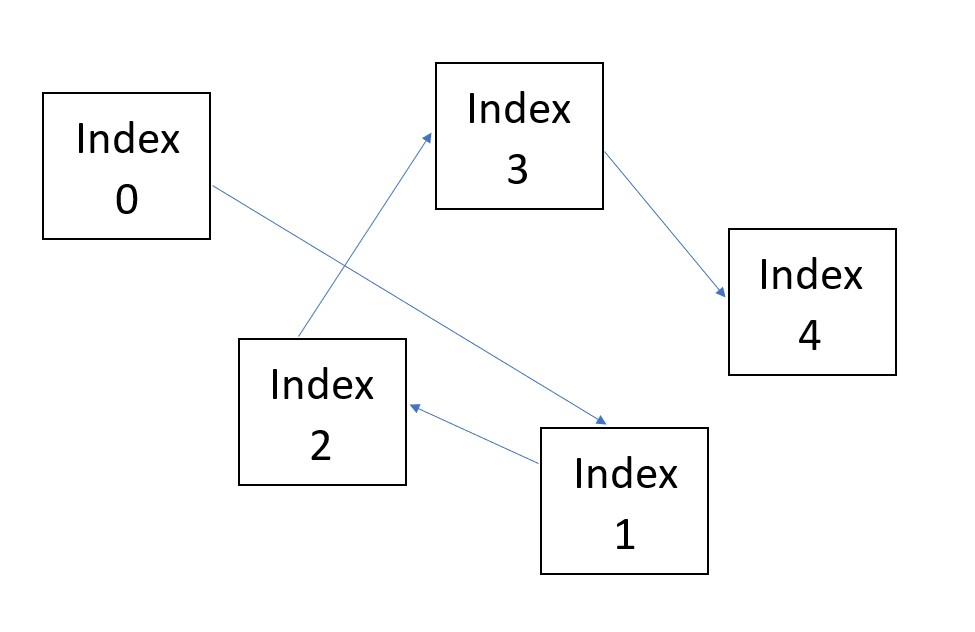

# Linked Lists
You made it to linked lists! That either means that you have a burning passion for learning or you're just really determined to finish that assignment.
## Introduction
Linked lists might seem a little daunting at first but I promise they aren't nearly as bad as they seem. By now, I'm sure you are very familiar with the dynamic array, or at least the array in general. One way to think about linked lists is like a chopped up array. If, for example, we have an array with 5 elements, it would look like this:


Below the array is what the same array would look like chopped up by each element. This is kind of what linked lists look like. In addition to this, the memory used by the linked list data structure can be from many different places, it doesn't have to be contiguous like the dynamic array. This can be done because the *nodes* as they are called (more on this later) point to one another. For all we know the list could look something like this in memory:


But for my sanity and yours, from here on out we will represent our linked lists like this:


Much better, huh?

## Effeciency
Compared to the dynamic array, the linked list has the effeciency as follows: 

Operation|Dynamic Array|Linked List|
---------|-------------|-----------|
Adding to Front|O(n)|O(1)|
Adding to Middle|O(n)|O(n)|
Adding to End|O(1)|O(1)|
Removing from Front|O(n)|O(1)
Removing from Middle|O(n)|O(n)
Removing from End|O(1)|O(1)|

As you can see, linked lists have better effeciency when adding to or removing from the beginning. This is because instead of shifting all of the subsequent items in memory over, we only need to define a new "head" to our list. Our linked lists have some new termonolgy as well. When we refer to the **head** of the linked list, we mean the very first, or index 0 if you will, of the list. The **tail** refers to the very last index of the list and **node** refers to any of the idexes in the list. 

## Node Breakdown
Those nodes that we were just talking about have some very special attributes that give us that better efficency. Each node has 3: **previous**, **data**, and **next**. Previous points the to node before the current node. Data is the data held inside the current node. And next points to the node after the current. Conceputally this might be a little confusing so look at it this way...


The node previous to this one has a next attribute that points to the current one. Our current node also has a previous attribute that points to the one before it. The next node has a previous attribute that points to the current one while the current node's next attribute points to the next one. They are *linked*, hence the reason for the name *linked lists*.

## Appending, Removing, and Inserting
Now that we are somewhat familiar with linked lists, lets take a look at how to do some of the more basic functions with them. 

Here is what we are doing when we append to our linked list:

1. Create our new node 
1. Set the *previous* of the new node to the tail.
1. Set the *next* of the current tail to the new node.
1. Set the tail equal to the new node

In code, it would look something like this (assuming we have the class already created or imported):

```python
new_node = LinkedList.Node(value)
new_node = self._tail
self.tail.next = new_node
self.tail = new_node
```

What about removing a node from the list? How do you think that would work?

Were you thinking of something like this?

To remove a node from the middle of the list, we would just need to reassign a few attributes of the surrounding nodes. Once a node has nothing pointing to it, python magically determines that it isn't being used and is therefore trash. Python then takes care of that trash for us behind the scenes so we don't have to worry about reclaiming that space. Neat, huh!

If we call our current node the one that we are trying to remove, the code would look like this:

```python
current._previous = None
current._next = None
current._previous._next = current._next
current._next._previous = current._previous
```

Lastly, what would it look like if we were to insert a node into the middle of the list?


Here's what were doing here.
1. Create the new node
1. Set the previous of the new node to the current node.
1. Set the next of the new node to the next node after current
1. Set the previous of the next node after current to the new node.
1. Set the next of the current node to the new node.

```python
new_node = LinkedList.Node(value)
new_node._previous = current_node
new_node._next = current._next
current._next._previous = new_node
current_node._next = new_node
```

And that is all you need to know about Linked Lists. 

Now it's your turn to give it a try. Below are two sample problems with their solutions. Once you've given the samples a try, check it with the solutions and see how you did!

[Sample Problem 1](ll_sample_problem1.py)

[Sample Problem 2](ll_sample_problem2.py)

[Sample Problem Solution 1](ll_sample_problem_solution1.py)

[Sample Problem Solution 2](ll_sample_problem_solution2.py)

When you're finished, you can click [here](welcome.md) to return to the welcome screen to check out some of the other awesome tutorials.
