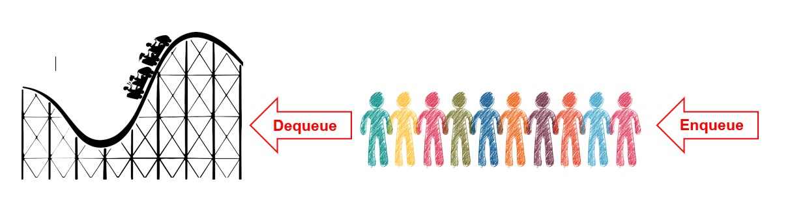
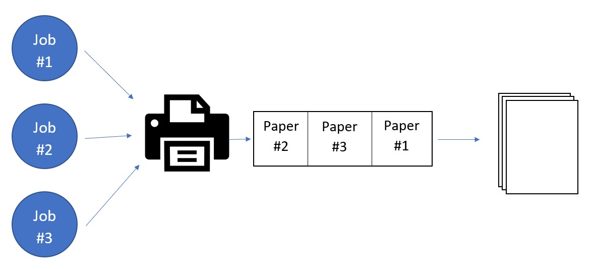

# Queues

Oh wow, you clicked on the link? You are serious about learning about this stuff...

Ok then, if you really want to know about queues then here you go. 

## Introduction
Imagine you're in line at an amusement park waiting to get on a ride. How cool would it be if someone came up to the line and cut in front? Not very cool at all, right? Queues are like lines at an amusement park. They follow a *First in First Out* (FIFO) order. When you enter the line, you enter at the back and are *'enqueueing'* and when you board the ride, you are *'dequeueing'* (no, I don't mean the ice cream place).

You can count on queues to make things fair in the world because you know that just like the elementary school saying, "no cuts, no buts, no coconuts'. Every item in the queue will be processed in the order that it entered it.

## Efficiency

What's that? The efficiency of the queue? Good question! 

Do you remember our good friend the dynamic array? If you think about it, our queue is much like the dynamic array that we are already familiar with, the only difference is that we are restricted to appending to the end of the queue and poping from the front. No inserting in the middle allowed. While this might seem inconvenient, it allows for more control of the data coming into the program. The Big O notation is as follows:
 
Operation |Command  |Efficiency|
----------|---------|----------|
Enqueue   |.append()|O(1)      |
Dequeue   |.pop(0)  |O(n)      |

For adding the the end of the queue is the same for adding to the end of an array, O(1). It's O(1) because all we need to do it append to the list using the appropiate command. In the case of removing from the front, the Big O would be O(n) because once we remove the first element from the list, we need to shuffle all of the other elements in the list down one space. Depending on how many items are in the data structure, that could take some time. There is a special case for this though. If we use a linked list for our base instead of a dynamic array, our Big O for dequeueing changes from O(n) to O(1). More on this later in the linked list section of the tutorial.

## Real World
Queues are super cool and all but when would we ever use them in the programming world? How about when you buy that new online game that you've been watching? When you sign into the game you are probably put in a queue to determine when you get to actually log on. You might even have to wait until a few others sign off becuase the queue has reached it's maximum capacity. 
 
What about when you try to print your final project to the library printer? Depending on how many people are in the library and are trying to print something will determine how long you'll have to wait before your paper gets printed, unless your school has a printer that can print 20 different files at the same time of course. Or maybe you work at NASA or something.


In the picture above, let us say that job #1 corresponds to paper #1, job 2 to paper 2 and so on. If the papers are printed in the order that the user requested the printer to print, we know that job 2 was sent first, then job 3, then job 1. 

## Enqueueing and Dequeueing
Enqueuing and Dequeuing are similar to appending and poping from a dynamic array, in fact, we can even use the same operations from dynamic arrays to work with queues! Hooray for recycling!
```python
 def I_choose_queue(self):
    my_queue = []
    my_queue.append('Billy')
    print(length(my_queue))
    #this prints a 1
    print(my_queue.pop(0))
    #this prints Billy
```

Now is your turn to try out queues and see if this guide taught you anything. Below are some practice problems and their solutions for you to check your work AFTER you've attempted the problems.

[Sample Problem 1](queue_sample_problem.py)

[Sample Problem 2](queue_sample_problem2.py)

[Sample Problem 1 Solution](queue_sample_problem_solution.py)

[Sampel Problem 2 Solution](queue_sample_problem_solution2.py)

When you're finished, you can click [here](welcome.md) to return to the welcome screen to check out some of the other awesome tutorials.