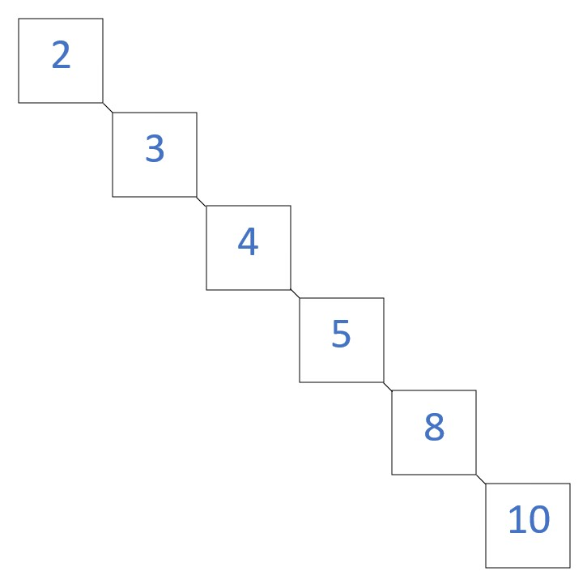

# Trees

Well, well, well, you made it to the last study topic for this tutorial, congratulations! 

## Introduction
This section will cover trees. No not the green kind outside you window. We will be talking about binary search trees. Binary search trees differ from the ones outside in really only one way. That is, they are not green unless you want to think of them as being green, then there's really no difference. Anyway, Binary search trees, or BSTs for short have **branches** and **leaves**. The branches in this case are the parts of the BST that "branch" off (get it, *branch*) of the main or head node. The leaves are the nodes that have nothing branching off of them. Kinda like leaves in a real tree, there is nothing else coming off of those either. The nodes of our tree are similar to the nodes of our linked lists in that they have pointers to their connecting nodes. In trees though we call them **left** and **right** nodes, not next and previous. 

## Efficiency
Because of the way that trees work, a balanced tree has O(log n) efficiency. Remember what our graph from Big O Notation looked like? This is one of the best performances that you can get from a data structure! Here's why. For every node that we go down in the tree, there is essentially half as much data remaining left to sort through. Imagine that we are looking to find the value 4 in the picture above. We check if the 5 is it, if not we know that lower values of 5 are on the left and higher values of 5 are on the right, therefore, we know that 4 must be on the left. Now we are looking at the 3 node. From here, we know that higher values than 3 are on the right while lower values of 3 are on the left. 4 is higher than 3 so we know our desired value must be to the right. We check again and see that we have arrived at our desired value and can stop searching. In table form, here is a list of some of the functions that we might use followed by their efficiency.

Operation|Description|Performance
---------|-----------|-----------
insert(value)|Inserts a value into tree|O(log n)
remove(value)|Removes a value from the tree|O(log n)
contains(value)|Checks if there is given value in tree|O(log n)
traverse_forward()|displays node values in ascending order|O(log n)
traverse_backward()|Displays node values in descending order|O(log n)
height(node)|Returns the height at given node (more details later)|O(log n)
size()|Returns the size of the tree|O(1)

## Balanced and Unbalanced BSTs
You might be thinking that trees are great and easy but we have to make sure that our trees are balanced. How might a tree be balanced you ask? Going back to our regular tree example, imagine if only one side of the tree had branches and leaves. It would look really weird, wouldn't it? Same thing with our BSTs. If we had a BST with branches and leaves on only one side, it would look like this: 


It is considered to be unbalanced. In order to make our tree balanced, we would need to move a few of the nodes around. A balanced tree is one in which the difference between 2 branches to their furthest leaf is no more than 2. For example:


In this picture, the tree on the left is unblanced because of the large difference in the lenths of the two subtrees. In the tree on the right, the difference betweent the lengths is less than two so it is balanced. It is also very helpful to draw out your tree on paper. This way, you can SEE it and can just look at it to tell if it is balanced or not.

## Basic Operations
Trees kinda remind me of a combination of queues and linked lists in the way that they are set up. A tree takes the shape of a linked list that behaves similar to a queue in that when we add to it, we are appending to the end of the branch and not the middle of one. We also have pointers to each new node that we create complete with with its left and right pointers and its data. Let's take a look at what appending might look like in actual code, assuming that we have our Node class set up with attributes left, right and data.

```Python
def insert_value(value, current) #receives value to insert and what node we are currently looking at.
#First determine if we are going left or right.
if data < current.data: #Going left
    if current.left == None: #Reached end of branch and empty spot is found
        current.left = data
    else:
        self.insert(data, current.left)
elif current.data == value:
    return
else: #Going right
    if current.right == None: #Reached end of branch and empty spot is found
        current.right = data
    else:
        self.insert(data,current.right)
```
You might have noticed that we are calling the same function that we are in to help us solve our challenge. This is called **recursion**. We will talk more about that later (It's super fun, you'll like it). This insert function simple checks to see if the value we want to insert is less than (meaning that it goes to the left) or greater than the current node (goes to the right) knowing that we are going to start at the top with the head or top of the tree. If the value we want is less than that of the head it goes to the left and checks if there is an opening that where we can put it. If not we pass the node left of the head (current.left) back to the function to test again. This time we check to see if the node left of the head (we'll call it node_L) has space either to the left or to the right of iteself for our new value with `node_L.left` or `node_L.right`. We continue to do this until we find a space for our new value. What about the case that our value is already in our tree? That depends on what you want your program to do but in this case we don't want any duplicates in the tree so we ignore it.

Should you want to remove a node, it gets a little more complicated. We would need to remove references to that node and rearrarange the tree to reflect the new organization. What about iterating through the tree and printing all of the nodes within? We would need to find a way to get the values from each node. 

```python
if node is not None:
    yield from self._traverse_forward(node.left)
    yield node.data
    yield from self._traverse_forward(node.right)
```
If you aren't already familiar with `yield`, it acts like a return without changing position. In this case `yield` will print the value at the current node and continue on with the rest of the commands.

## Recursion
Have you ever heard of the movie "Inception"? If not, the main concept of the movie is going into "dreams within dreams". Recursion is conceptually the same minus the dream part. Instead, we are going "functions within functions" so you can say we are cooler than them. In fact, the movie only goes 3 or 4 dreams deep but we have the possibility to go infinately many functions deep. Obviously, that would create a problem and we would never want to do that, (the Python intrepter actually prevents us from doing that anyway) but it's possible. 

Recursion is really the process of breaking down complex and difficult problems into smaller ones that we know how to work with. It begins by identifing a base case that we know will happen so that we don't end up with an infinite loop. Once we get that, we can build up from there. Take the following function for example:

```python
def recursion(self, data, length):
    print(data[length])
    recursion(data, length-1)
```
Assuming that data is a list, we are really just printing each value of data. Why would we ever do something like this when we could accomplish the same exact thing in a `for` loop you ask? Well, we could but 1. That wouldn't be as cool and 2. Some problems are better solved with recursion.

That's it! You know the drill by now. It's your turn to give it a go. Below are the sample problems followed by the solutions. Remember to try the problems before taking a peek at the solutions!

[Sample Problem #1](trees_sample_problem1.py)

[Sample Problem #2](trees_sample_problem2.py)

[Sample Problem Solution #1](trees_sample_problem1_solution.py)

[Sample Problem Solution #2](trees_sample_problem2_solution.py)
